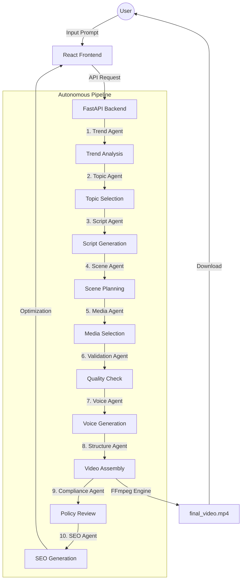

# VideoForge AI 🎬

[](https://www.python.org/)
[](https://fastapi.tiangolo.com/)
[](https://reactjs.org/)
[](LICENSE)

**VideoForge AI** is a state-of-the-art, 16-agent autonomous video production platform. It transforms a simple idea or trending topic into a high-retention, professional-grade video optimized for YouTube, TikTok, and Instagram.

---

## 🚀 Key Features

- **Autonomous 10-Phase Pipeline**: From trend detection to final assembly, handled entirely by specialized AI agents.
- **Dynamic Asset Sourcing**: Automatically fetches high-quality stock footage from Pexels and Pixabay.
- **Multilingual Voice Synthesis**: Supports multiple high-fidelity TTS providers (Edge, ElevenLabs, Kokoro).
- **Format-Aware Rendering**: Seamlessly generates content for both 16:9 (Long-form) and 9:16 (Shorts) aspect ratios.
- **Encrypted Key Management**: Securely store and manage your API credentials with AES-256 encryption.
- **Built-in SEO & Compliance**: Automatic generation of optimized titles, descriptions, and tags, with automated YouTube policy checks.

---

## 🏗 Architecture



---

## 🛠 Tech Stack

- **Backend**: Python 3.11+, FastAPI, Uvicorn, FFmpeg
- **Frontend**: React 18, Vite 5, CSS3 (Glassmorphism UI)
- **AI Models**: Google Gemini 1.5 Flash (Orchestration), Groq (Fast Inference)
- **Media APIs**: Pexels, Pixabay
- **Voice APIs**: ElevenLabs, Edge TTS, Unreal Speech

---

## 🚦 Quick Start

### 1. Prerequisites
- Python 3.11 or higher
- Node.js 18 or higher
- FFmpeg installed and added to your system PATH

### 2. Installation

**Backend Setup:**
```bash
# Clone the repository
git clone https://github.com/PRINCEk0001/K-trimapraj-video-maker.git
cd K-trimapraj-video-maker

# Install dependencies
pip install -r requirements.txt
```

**Frontend Setup:**
```bash
cd frontend
npm install
```

### 3. Configuration
1. Copy `.env.example` to `.env`.
2. Open the dashboard and navigate to **Settings** to securely input your API keys (Gemini is required).

### 4. Running the Platform

**Start Backend:**
```bash
# From the root directory
uvicorn backend.main:app --reload --port 8001
```

**Start Frontend:**
```bash
# From the frontend directory
npm run dev
```

Visit **http://localhost:5173** to start creating!

---

## 📖 Usage Guide

1. **Idea Generation**: Enter a topic or let the Trend Agent find what's viral.
2. **Audio/Visual Setup**: Select your preferred voice, speed, and visual style (Realistic or Cartoon).
3. **Forging**: Watch as the 10-phase pipeline builds your video in real-time.
4. **Export**: Preview the results and download your ready-to-upload MP4.

---

## 🤝 Contributing

Contributions are welcome! Please feel free to submit a Pull Request.

## 📄 License

This project is licensed under the MIT License - see the LICENSE file for details.

## 🚀 Deployment

### Recommended: Docker (Railway, Render, VPS)
The project includes a `Dockerfile` that automatically handles the installation of FFmpeg and all Python dependencies.

1.  **Build the image**:
    ```bash
    docker build -t videoforge .
    ```
2.  **Run the container**:
    ```bash
    docker run -p 8001:8001 --env-file .env videoforge
    ```

### Manual Deployment (Ubuntu/Debian)
If deploying manually on a VPS:
1.  Install FFmpeg: `sudo apt update && sudo apt install ffmpeg`
2.  Install Python deps: `pip install -r requirements.txt`
3.  Run Backend: `uvicorn backend.main:app --host 0.0.0.0 --port 8001`
4.  Deploy Frontend: Use Vercel or Netlify for the `frontend/` directory (point proxy to your backend URL).

---

*Built with ❤️ by the VideoForge Team*
